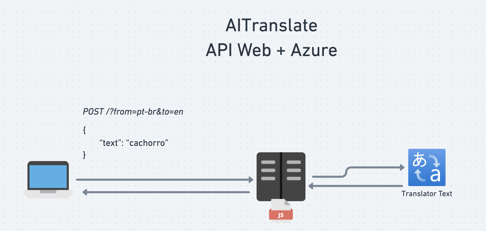
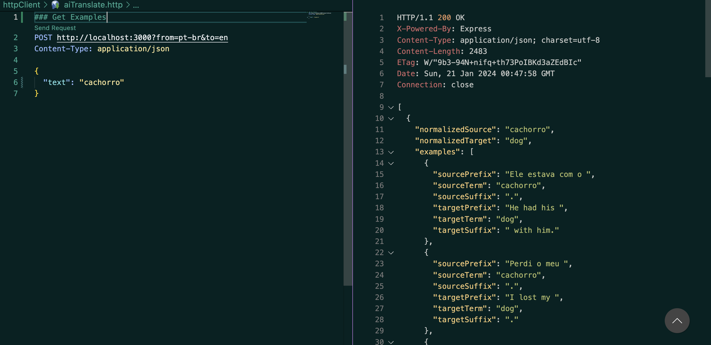

# AITranslate - Express.js + Azure AI Translator
---

##### Description:

_A simple monolithic API built in Express.js, shared on my YouTube channel to demonstrate how to use the Azure AI Translator Service for retrieving a list of usage examples for a requested word._

---

### *How it works*



##### Example Sending a Request



---

#### Run with Docker Compose 🐳


Steps:

1. Create the Azure AI Translator Service in the Azure portal.

2. Obtain the key, endpoint, and region, and add them to the .env.example file.

3. Rename the .env.example to .env.

4. You're ready to start! 🥳

Now, execute the following command in your terminal:

```bash
  docker compose up -d
```

If you haven't changed the `PORT` variable in the .env file, you can now access the application on `PORT 3000`.

One last point: you cold start testing the API using the _aiTranslate.http_ file, located inside the [httpClient folder](./httpClient/aiTranslate.http)

